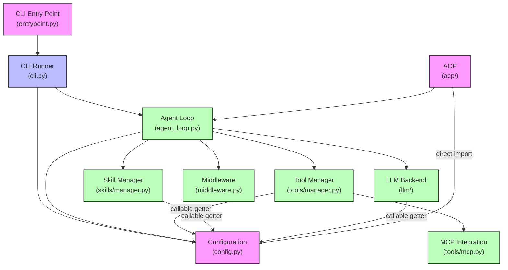

# python312.rule
# Rule for enforcing modern Python 3.12+ best practices.
# Applies to all Python files (*.py) in the project.
#
# Guidelines covered:
# - Use match-case syntax instead of if/elif/else for pattern matching.
# - Use the walrus operator (:=) when it simplifies assignments and tests.
# - Favor a "never nester" approach by avoiding deep nesting with early returns or guard clauses.
# - Employ modern type hints using built-in generics (list, dict) and the union pipe (|) operator,
#   rather than deprecated types from the typing module (e.g., Optional, Union, Dict, List).
# - Ensure code adheres to strong static typing practices compatible with static analyzers like pyright.
# - Favor pathlib.Path methods for file system operations over older os.path functions.
# - Write code in a declarative and minimalist style that clearly expresses its intent.
# - Additional best practices including f-string formatting, comprehensions, context managers, and overall PEP 8 compliance.

description: "Modern Python 3.12+ best practices and style guidelines for coding."
files: "**/*.py"

guidelines:
  - title: "Match-Case Syntax"
    description: >
      Prefer using the match-case construct over traditional if/elif/else chains when pattern matching
      is applicable. This leads to clearer, more concise, and more maintainable code.

  - title: "Walrus Operator"
    description: >
      Utilize the walrus operator (:=) to streamline code where assignment and conditional testing can be combined.
      Use it judiciously when it improves readability and reduces redundancy.

  - title: "Never Nester"
    description: >
      Aim to keep code flat by avoiding deep nesting. Use early returns, guard clauses, and refactoring to
      minimize nested structures, making your code more readable and maintainable.

  - title: "Modern Type Hints"
    description: >
      Adopt modern type hinting by using built-in generics like list and dict, along with the pipe (|) operator
      for union types (e.g., int | None). Avoid older, deprecated constructs such as Optional, Union, Dict, and List
      from the typing module.

  - title: "Strong Static Typing"
    description: >
      Write code with explicit and robust type annotations that are fully compatible with static type checkers
      like pyright. This ensures higher code reliability and easier maintenance.

  - title: "Pydantic-First Parsing"
    description: >
      Prefer Pydantic v2's native validation over ad-hoc parsing. Use `model_validate`,
      `field_validator`, `from_attributes`, and field aliases to coerce external SDK/DTO objects.
      Avoid manual `getattr`/`hasattr` flows and custom constructors like `from_sdk` unless they are
      thin wrappers over `model_validate`. Keep normalization logic inside model validators so call sites
      remain declarative and typed.

  - title: "Pathlib for File Operations"
    description: >
      Favor the use of pathlib.Path methods for file system operations. This approach offers a more
      readable, object-oriented way to handle file paths and enhances cross-platform compatibility,
      reducing reliance on legacy os.path functions.

  - title: "Declarative and Minimalist Code"
    description: >
      Write code that is declarative—clearly expressing its intentions rather than focusing on implementation details.
      Strive to keep your code minimalist by removing unnecessary complexity and boilerplate. This approach improves
      readability, maintainability, and aligns with modern Python practices.

  - title: "Additional Best Practices"
    description: >
      Embrace other modern Python idioms such as:
      - Using f-strings for string formatting.
      - Favoring comprehensions for building lists and dictionaries.
      - Employing context managers (with statements) for resource management.
      - Following PEP 8 guidelines to maintain overall code style consistency.

  - title: "Exception Documentation"
    description: >
      Document exceptions accurately and minimally in docstrings:
      - Only document exceptions that are explicitly raised in the function implementation
      - Remove Raises entries for exceptions that are not directly raised
      - Include all possible exceptions from explicit raise statements
      - For public APIs, document exceptions from called functions if they are allowed to propagate
      - Avoid documenting built-in exceptions that are obvious (like TypeError from type hints)
      This ensures documentation stays accurate and maintainable, avoiding the common pitfall
      of listing every possible exception that could theoretically occur.

  - title: "Modern Enum Usage"
    description: >
      Leverage Python's enum module effectively following modern practices:
      - Use StrEnum for string-based enums that need string comparison
      - Use IntEnum/IntFlag for performance-critical integer-based enums
      - Use auto() for automatic value assignment to maintain clean code
      - Always use UPPERCASE for enum members to avoid name clashes
      - Add methods to enums when behavior needs to be associated with values
      - Use @property for computed attributes rather than storing values
      - For type mixing, ensure mix-in types appear before Enum in base class sequence
      - Consider Flag/IntFlag for bit field operations
      - Use _generate_next_value_ for custom value generation
      - Implement __bool__ when enum boolean evaluation should depend on value
      This promotes type-safe constants, self-documenting code, and maintainable value sets.

  - title: "No Inline Ignores"
    description: >
      Do not use inline suppressions like `# type: ignore[...]` or `# noqa[...]` in production code.
      Instead, fix types and lint warnings at the source by:
      - Refining signatures with generics (TypeVar), Protocols, or precise return types
      - Guarding with `isinstance` checks before attribute access
      - Using `typing.cast` when control flow guarantees the type
      - Extracting small helpers to create clearer, typed boundaries
      If a suppression is truly unavoidable at an external boundary, prefer a narrow, well-typed wrapper
      over in-line ignores, and document the rationale in code comments.

  - title: "Pydantic Discriminated Unions"
    description: >
      When modeling variants with a discriminated union (e.g., on a `transport` field), do not narrow a
      field type in a subclass (e.g., overriding `transport: Literal['http']` with `Literal['streamable-http']`).
      This violates Liskov substitution and triggers type checker errors due to invariance of class attributes.
      Prefer sibling classes plus a shared mixin for common fields and helpers, and compose the union with
      `Annotated[Union[...], Field(discriminator='transport')]`.
      Example pattern:
      - Create a base with shared non-discriminator fields (e.g., `_MCPBase`).
      - Create a mixin with protocol-specific fields/methods (e.g., `_MCPHttpFields`), without a `transport`.
      - Define sibling final classes per variant (e.g., `MCPHttp`, `MCPStreamableHttp`, `MCPStdio`) that set
        `transport: Literal[...]` once in each final class.
      - Use `match` on the discriminator to narrow types at call sites.

  - title: "Use uv for All Commands"
    description: >
      We use uv to manage our python environment. You should nevery try to run a bare python commands.
      Always run commands using `uv` instead of invoking `python` or `pip` directly.
      For example, use `uv add package` and `uv run script.py` rather than `pip install package` or `python script.py`.
      This practice helps avoid environment drift and leverages modern Python packaging best practices.
      Useful uv commands are:
      - uv add/remove <package> to manage dependencies
      - uv sync to install dependencies declared in pyproject.toml and uv.lock
      - uv run script.py to run a script within the uv environment
      - uv run pytest (or any other python tool) to run the tool within the uv environment

# Mistral Vibe Project Analysis

[Return to top](#mistral-vibe-project-analysis)

## Overview
Mistral Vibe is an open-source CLI coding assistant powered by Mistral's AI models. It provides a conversational interface to interact with codebases through natural language commands and a powerful set of tools.

## Project Structure

### Root Directory
- **README.md**: Main documentation with installation, usage, and feature descriptions
- **CHANGELOG.md**: Release history and changes
- **AGENTS.md**: Coding guidelines and safety rules for development
- **pyproject.toml**: Project configuration, dependencies, and build settings
- **vibe/**: Main source code directory
- **tests/**: Test suite
- **distribution/**: Distribution files for package managers
- **docs/**: Additional documentation
- **scripts/**: Utility scripts

### Main Source Code Structure

#### `vibe/` Directory
```
vibe/
├── __init__.py
├── acp/                  # Agent Client Protocol implementation
├── cli/                  # Command-line interface components
│   ├── autocompletion/   # Autocompletion features
│   ├── plan_offer/       # Plan offering system
│   ├── textual_ui/       # Textual-based UI components
│   ├── update_notifier/  # Auto-update functionality
│   ├── entrypoint.py     # Main CLI entry point
│   └── ...
├── core/                 # Core functionality
│   ├── agents/           # Agent management and profiles
│   ├── autocompletion/   # Autocompletion logic
│   ├── llm/              # LLM backend integration
│   ├── lsp/              # Language Server Protocol support
│   ├── prompts/          # System prompts and templates
│   ├── session/          # Session management
│   ├── skills/           # Skills system for extensibility
│   ├── tools/            # Built-in tools and tool management
│   ├── agent_loop.py     # Main agent loop logic
│   ├── config.py         # Configuration management
│   └── ...
├── setup/                # Setup and onboarding flows
└── whats_new.md          # Release notes
```

## Key Features

### 1. Interactive Chat Interface
- Conversational AI agent for natural language interactions
- Multi-line input support with Ctrl+J/Shift+Enter
- File path autocompletion with `@` symbol
- Shell command execution with `!` prefix
- External editor integration with Ctrl+G

### 2. Powerful Toolset
The core of Mistral Vibe's functionality is its extensive toolset:

**Built-in Tools:**
- `read_file`: Read files with line offsets
- `write_file`: Create or overwrite files
- `search_replace`: Search and replace in files
- `grep`: Recursive pattern searching
- `bash`: Execute shell commands
- `todo`: Task management
- `task`: Subagent delegation
- `ask_user_question`: Interactive user questions
- `lsp`: Language Server Protocol integration
- `read_image`: Image reading and processing

**MCP Support:**
- HTTP, streamable-HTTP, and stdio transports
- Configurable API keys and headers
- Tool execution timeouts and startup timeouts
- Environment variable support

### 3. Agent System
Mistral Vibe uses an agent-based architecture with multiple built-in profiles:

- **default**: Standard agent requiring approval for tool executions
- **plan**: Read-only agent for exploration and planning
- **accept-edits**: Auto-approves file edits only
- **auto-approve**: Auto-approves all tool executions
- **explore**: Read-only subagent for codebase exploration

Agents can be customized through configuration files in `~/.vibe/agents/`

### 4. Skills System
Extensible system for adding custom functionality:
- Skill discovery from multiple locations
- Pattern-based skill enabling/disabling
- Custom slash commands
- Reusable components

### 5. Configuration
Flexible configuration system with:
- TOML-based configuration files
- Environment variable support
- API key management
- Custom system prompts
- Tool permission management
- MCP server configuration

### 6. Session Management
- Session continuation and resumption
- Message persistence
- Working directory control
- Session logging

### 7. LSP (Language Server Protocol) Support
- Multi-server diagnostics
- Mason package support
- Pyright and Ruff LSP server integration
- Code formatting and diagnostics

## Technical Stack

### Core Dependencies
- **Python**: 3.12+
- **Textual**: Modern terminal framework
- **Pydantic**: Data validation and settings management
- **Mistral AI SDK**: LLM backend integration
- **MCP**: Model Context Protocol for extensibility
- **Rich**: Terminal rendering
- **PyYAML**: YAML parsing
- **Python-dotenv**: Environment variable management

### Development Tools
- **pytest**: Testing framework
- **pyright**: Static type checking
- **ruff**: Linting
- **pre-commit**: Git hooks
- **uv**: Python package and environment management

## Architecture Patterns

### 1. Manager Pattern
The codebase uses a manager pattern for various components:
- `ToolManager`: Manages tool discovery, loading, and execution
- `AgentManager`: Manages agent profiles and configurations
- `SkillManager`: Manages skill discovery and loading

### 2. Middleware System
- Request/response middleware for tool execution
- Permission checking
- Tool execution approval
- Error handling

### 3. Event-Driven Architecture
- Session events
- Tool execution events
- UI update events
- Configuration change events

### 4. Pydantic-First Approach
- Strong typing with modern Python type hints
- Data validation using Pydantic models
- Configuration management with Pydantic settings

## Component Dependencies

### Core Dependency Graph

Based on actual import analysis, here's the correct dependency structure in Mermaid format:



**Key Dependency Patterns:**
- **CLI Entry Point → CLI Runner**: Entry point parses args and calls CLI runner
- **CLI Runner → Configuration**: Loads and manages configuration
- **CLI Runner → Agent Loop**: Creates and manages the AgentLoop instance
- **Agent Loop → Configuration**: Imports directly (not via callable)
- **Agent Loop → Tool Manager**: Imports and uses ToolManager
- **Agent Loop → Skill Manager**: Imports and uses SkillManager
- **Agent Loop → LLM Backend**: Imports and uses LLM backend
- **Agent Loop → Middleware**: Imports middleware components
- **Tool Manager → MCP**: Imports MCP integration for external tools
- **Tool Manager → Configuration**: Uses callable getter to avoid circular dependency
- **Skill Manager → Configuration**: Uses callable getter to avoid circular dependency
- **ACP → Configuration**: Imports configuration directly
- **ACP → Agent Loop**: Extends base AgentLoop for ACP protocol

### Detailed Component Interactions

#### 1. Configuration System (config.py)
**Actual Dependencies (imports):**
- `vibe.core.paths.config_paths` (CONFIG_DIR, CONFIG_FILE, PROMPTS_DIR)
- `vibe.core.paths.global_paths` (GLOBAL_ENV_FILE, GLOBAL_PROMPTS_DIR, SESSION_LOG_DIR)
- `vibe.core.prompts` (SystemPrompt)
- `vibe.core.tools.base` (BaseToolConfig)
- `dotenv` (dotenv_values)
- `pydantic` (BaseModel, Field, field_validator, model_validator)
- `pydantic_settings` (BaseSettings, PydanticBaseSettingsSource, SettingsConfigDict)

**Used by (who imports config.py):**
- `vibe.core.agent_loop` (VibeConfig)
- `vibe.core.tools.manager` (VibeConfig via callable getter)
- `vibe.core.skills.manager` (VibeConfig via callable getter)
- `vibe.core.llm.backend.*` (ModelConfig, ProviderConfig)
- `vibe.core.middleware` (VibeConfig)
- `vibe.cli.cli` (VibeConfig, MissingAPIKeyError, MissingPromptFileError)
- `vibe.cli.entrypoint` (VibeConfig)
- `vibe.acp.entrypoint` (VibeConfig)

**Key Features:**
- Layered configuration merging (default → project → user → env → CLI)
- TOML-based configuration files with `TomlFileSettingsSource`
- Environment variable support via `load_dotenv_values`
- API key management and validation
- Deep merge strategy for nested configurations via `_deep_merge`
- Pydantic-based data validation and settings management

#### 2. Tool Manager (tools/manager.py)
**Actual Dependencies (imports):**
- `vibe.core.paths.config_paths` (resolve_local_tools_dir)
- `vibe.core.paths.global_paths` (DEFAULT_TOOL_DIR, GLOBAL_TOOLS_DIR)
- `vibe.core.tools.base` (BaseTool, BaseToolConfig)
- `vibe.core.tools.mcp` (RemoteTool, create_mcp_http_proxy_tool_class, create_mcp_stdio_proxy_tool_class, list_tools_http, list_tools_stdio)
- `vibe.core.utils` (name_matches, run_sync)

**Used by (who imports tools/manager.py):**
- `vibe.core.agent_loop` (ToolManager)

**Key Features:**
- Dynamic tool discovery from multiple search paths
- MCP server integration with caching (HTTP, streamable-HTTP, stdio)
- Tool permission management based on configuration
- Lazy loading of tools via `_instances` dictionary
- Class-level MCP cache (`_mcp_cache`) for performance
- Canonical module name extraction for vibe package files

#### 3. Skill Manager (skills/manager.py)
**Actual Dependencies (imports):**
- `vibe.core.paths.config_paths` (resolve_local_skills_dir)
- `vibe.core.paths.global_paths` (GLOBAL_SKILLS_DIR)
- `vibe.core.skills.models` (SkillInfo, SkillMetadata)
- `vibe.core.skills.parser` (SkillParseError, parse_frontmatter)
- `vibe.core.utils` (name_matches)

**Used by (who imports skills/manager.py):**
- `vibe.core.agent_loop` (SkillManager)

**Key Features:**
- Skill discovery from multiple locations (local, global, project)
- Pattern-based skill enabling/disabling via `name_matches`
- Skill metadata parsing from SKILL.md files
- Duplicate skill handling (logs warnings, keeps first discovered)
- Unique path resolution to avoid duplicates

#### 4. Agent Loop (agent_loop.py)
**Actual Dependencies (imports):**
- `vibe.core.agents.manager` (AgentManager)
- `vibe.core.agents.models` (AgentProfile, BuiltinAgentName)
- `vibe.core.config` (VibeConfig)
- `vibe.core.llm.backend.factory` (BACKEND_FACTORY)
- `vibe.core.llm.exceptions` (BackendError)
- `vibe.core.llm.format` (APIToolFormatHandler, ResolvedMessage, ResolvedToolCall)
- `vibe.core.llm.types` (BackendLike)
- `vibe.core.middleware` (AutoCompactMiddleware, ContextWarningMiddleware, ConversationContext, MiddlewareAction, MiddlewarePipeline, MiddlewareResult, PlanAgentMiddleware, PriceLimitMiddleware, ResetReason, TurnLimitMiddleware)
- `vibe.core.prompts` (UtilityPrompt)
- `vibe.core.session.session_logger` (SessionLogger)
- `vibe.core.session.session_migration` (migrate_sessions_entrypoint)
- `vibe.core.skills.manager` (SkillManager)
- `vibe.core.system_prompt` (get_universal_system_prompt)
- `vibe.core.tools.base` (BaseTool, BaseToolConfig, InvokeContext, SpecialToolBehavior, ToolError, ToolPermission, ToolPermissionError, EventConstructor)
- `vibe.core.tools.manager` (ToolManager)
- `vibe.core.types` (AgentStats, ApprovalCallback, ApprovalResponse, AssistantEvent, AsyncApprovalCallback, BaseEvent, CompactEndEvent, CompactStartEvent, ContinueableUserMessageEvent, LLMChunk, LLMMessage, LLMUsage, RateLimitError, ReasoningEvent, Role, SyncApprovalCallback, ToolCallEvent, ToolResultEvent, ToolStreamEvent, UserInputCallback, UserMessageEvent)
- `vibe.core.utils` (TOOL_ERROR_TAG, VIBE_STOP_EVENT_TAG, CancellationReason, get_user_agent, get_user_cancellation_message, is_user_cancellation_event)

**Used by (who imports agent_loop.py):**
- `vibe.cli.cli` (AgentLoop)
- `vibe.core.tools.builtins.task` (AgentLoop)

**Key Features:**
- Main agent loop logic with async event processing
- Tool execution approval workflow with callbacks
- Middleware pipeline processing (before/after turn)
- Session management and persistence via SessionLogger
- Event handling for tool calls, results, and user messages
- Error handling and cancellation support
- Rate limit and cost limit enforcement

#### 5. LLM Backend (llm/)
**Actual Dependencies (imports in mistral.py):**
- `vibe.core.config` (ModelConfig, ProviderConfig)
- `vibe.core.llm.exceptions` (BackendErrorBuilder)
- `vibe.core.llm.types` (AvailableTool, Content, FunctionCall, LLMChunk, LLMMessage, LLMUsage, Role, StrToolChoice, ToolCall)
- `vibe.core.tools.manager` (ToolManager)
- `mistralai` (Mistral AI SDK)
- `httpx` (HTTP client)

**Used by (who imports llm/):**
- `vibe.core.agent_loop` (BACKEND_FACTORY, BackendLike)

**Key Features:**
- Multi-provider support (Mistral, generic)
- Model configuration management
- API request formatting with tool schemas
- Response parsing with reasoning content support
- Usage tracking and cost estimation
- Error handling and retry logic

#### 6. Middleware System (middleware.py)
**Actual Dependencies (imports):**
- `vibe.core.agents` (AgentProfile)
- `vibe.core.agents.models` (BuiltinAgentName)
- `vibe.core.utils` (VIBE_WARNING_TAG)

**Used by (who imports middleware.py):**
- `vibe.core.agent_loop` (AutoCompactMiddleware, ContextWarningMiddleware, ConversationContext, MiddlewareAction, MiddlewarePipeline, MiddlewareResult, PlanAgentMiddleware, PriceLimitMiddleware, ResetReason, TurnLimitMiddleware)

**Key Middleware Components:**
- `AutoCompactMiddleware`: Session compaction when message limit reached
- `ContextWarningMiddleware`: Context length warnings
- `PlanAgentMiddleware`: Plan agent behavior
- `PriceLimitMiddleware`: Cost limits
- `TurnLimitMiddleware`: Turn limits

### Data Flow

#### Initialization Flow
1. CLI entry point parses arguments
2. Configuration is loaded from files and environment
3. Trusted folder check is performed
4. Agent Loop is initialized with configuration
5. Tool Manager discovers and loads tools
6. Skill Manager discovers and loads skills
7. LLM Backend is initialized with model configuration

#### Runtime Flow
1. User input is received
2. Agent Loop processes input through middleware
3. LLM generates response with tool calls
4. Tool Manager executes tools
5. Skill Manager activates relevant skills
6. Results are formatted and displayed
7. Session is updated

#### Tool Execution Flow
1. LLM requests tool execution
2. Agent Loop checks permissions via middleware
3. Tool Manager validates and executes tool
4. MCP tools are proxied if needed
5. Results are returned to LLM
6. Response is formatted and displayed

### Circular Dependencies

The codebase avoids circular dependencies through careful design:

1. **Configuration as Single Source of Truth**: All managers depend on configuration but don't depend on each other
2. **Dependency Injection**: Managers receive configuration via callables rather than direct imports
3. **Lazy Loading**: Tools and skills are loaded on-demand rather than at initialization
4. **Interface-Based Design**: Components communicate through well-defined interfaces

### Key Integration Points

1. **Tool-Skill Integration**: Skills can extend or modify tool behavior
2. **Middleware-Pipeline**: Middleware can intercept and modify tool execution
3. **MCP-Tool Integration**: MCP servers provide external tools through the Tool Manager
4. **Config-Driven Architecture**: Most behavior is configurable without code changes

## Configuration-Driven Architecture

The architecture is highly configuration-driven, allowing extensive customization without code modifications:

### Configuration Layers
1. **Default Configuration**: Built into the code
2. **Project Configuration**: `./.vibe/config.toml`
3. **User Configuration**: `~/.vibe/config.toml`
4. **Environment Variables**: Override specific values
5. **Command-line Arguments**: Temporary overrides

### Configurable Aspects
- **Models**: LLM model selection and configuration
- **Tools**: Enable/disable tools with patterns
- **MCP Servers**: External tool servers
- **Skills**: Skill discovery and activation
- **Permissions**: Tool execution approval workflows
- **Session**: Logging and persistence settings
- **UI**: Theme and display preferences
- **Update**: Auto-update behavior

### Configuration Merging Strategy
The configuration system uses a layered merging approach:
1. Load default configuration
2. Merge project configuration
3. Merge user configuration
4. Apply environment variable overrides
5. Apply command-line argument overrides

This allows for:
- Site-specific configurations
- User preferences
- Temporary overrides for testing
- Environment-specific settings

## Development Guidelines

### Coding Standards
- **Python 3.12+**: Modern Python features required
- **Type Hints**: Strong static typing with modern generics
- **Pathlib**: Preferred over os.path
- **Match-Case**: Preferred over if/elif chains
- **Walrus Operator**: Used judiciously
- **Never Nester**: Avoid deep nesting
- **No Inline Ignores**: Fix type/lint issues at source

### Testing Requirements
- **Unit Tests**: Mandatory for all code changes
- **UI Tests**: Mandatory for UI changes using `terminalcp_terminalcp`
- **Minimize Mocking**: Prefer real implementations over mocks

### Safety Rules
- **No Unauthorized Changes**: Never modify code without explicit permission
- **Git Safety**: Careful with destructive operations
- **Production Directories**: Never modify `~/.vibe` during development
- **Task Management**: Use todo tool for tracking

## Configuration System

### Configuration File Locations
1. `./.vibe/config.toml` (project-specific)
2. `~/.vibe/config.toml` (user-specific)

### Key Configuration Sections
- **models**: LLM model configurations
- **tools**: Tool permissions and settings
- **mcp_servers**: MCP server configurations
- **skills**: Skill management
- **session**: Session settings
- **update**: Auto-update settings

### Example Configuration
```toml
[models]
default = "mistral-large-latest"

[tools]
enabled_tools = ["read_file", "write_file", "grep"]
disabled_tools = ["bash*", "mcp_*"]

[tools.bash]
permission = "ask"

[[mcp_servers]]
name = "my_server"
transport = "http"
url = "http://localhost:8000"

[session]
enable_logging = true
max_message_history = 100
```

## Build and Release

### Build Process
- Uses `hatchling` as build backend
- Package includes only `vibe/` directory
- Entry points: `vibe` and `vibe-acp`
- Uses `uv` for package and environment management

### Release Process
- Version bumping via `scripts/bump_version.py`
- Release automation via GitHub Actions
- Changelog generation
- PyPI and package manager distribution

## Testing Strategy

### Test Organization
```
tests/
├── acp/                  # ACP protocol tests
├── backend/              # Backend integration tests
├── cli/                  # CLI tests
├── core/                 # Core functionality tests
├── mock/                 # Mock implementations
├── onboarding/           # Onboarding flow tests
├── playground/           # Playground tests
├── session/              # Session management tests
├── skills/               # Skills system tests
├── snapshots/            # Snapshot tests for UI
├── stubs/                # Test stubs
├── tools/                # Tool tests
└── update_notifier/      # Update notifier tests
```

### Test Types
- **Unit Tests**: Core functionality
- **Integration Tests**: Component interactions
- **UI Tests**: Terminal-based UI testing
- **Snapshot Tests**: Visual regression testing
- **Mock Tests**: External service mocking

## Key Files and Directories

### Core Functionality
- `vibe/core/agent_loop.py`: Main agent loop
- `vibe/core/config.py`: Configuration management
- `vibe/core/tools/manager.py`: Tool management
- `vibe/cli/entrypoint.py`: CLI entry point

### Tools
- `vibe/core/tools/builtins/`: Built-in tool implementations
- `vibe/core/tools/mcp.py`: MCP server integration

### LSP Support
- `vibe/core/lsp/`: LSP client and server management
- `vibe/core/tools/builtins/lsp.py`: LSP tool implementation

### UI Components
- `vibe/cli/textual_ui/`: Textual-based UI widgets
- `vibe/cli/terminal_setup.py`: Terminal configuration

## Recent Developments (from git log)

### Recent Commits
1. **feat: add Mason packages support for LSP servers**
   - Mason package integration for LSP servers
   - Improved LSP server management

2. **feat: add message queuing during compaction**
   - Message queueing system
   - Session compaction improvements

3. **feat: improve tool execution security and config merging**
   - Enhanced tool security
   - Better configuration merging

4. **feat: implement multi-server diagnostics support**
   - Multi-LSP server diagnostics
   - Improved diagnostic handling

5. **feat: add Ruff LSP server support**
   - Ruff LSP integration
   - Code formatting support

6. **fix: update LSP tool to handle server restarts**
   - Improved LSP server lifecycle management
   - Better error handling for server restarts

7. **refactor: improve LSP client management and server lifecycle**
   - Enhanced LSP client management
   - Better server lifecycle handling

8. **feat: add LSP utility classes for server detection and project root finding**
   - Server detection utilities
   - Project root finding utilities

9. **test: improve LSP tests with timeouts and better assertions**
   - Improved test coverage for LSP functionality
   - Better test assertions

10. **docs: update AGENTS.md to reference main branch for coding style**
    - Updated documentation to reference main branch for coding style

## Installation Methods

### Recommended (One-line)
```bash
curl -LsSf https://mistral.ai/vibe/install.sh | bash
```

### Using uv
```bash
uv tool install mistral-vibe
```

### Using pip
```bash
pip install mistral-vibe
```

### Development Installation
```bash
uv sync --all-extras --dev
```

## Usage Examples

### Interactive Mode
```bash
cd /path/to/project
vibe
```

### Programmatic Mode
```bash
vibe --prompt "Analyze the codebase" --max-turns 5 --output json
```

### With Custom Agent
```bash
vibe --agent plan
```

### Continue Session
```bash
vibe --continue
```

### ACP Mode
```bash
vibe-acp
```

## Configuration Management

### Setup API Key
```bash
vibe --setup
```

### Custom Configuration
```bash
# Create ~/.vibe/config.toml
active_model = "mistral-large-latest"
enabled_tools = ["read_file", "grep"]
```

## Extensibility

### Creating Skills
```
~/.vibe/skills/my-skill/
├── SKILL.md          # Skill metadata
└── implementation.py # Skill logic
```

### Adding MCP Servers
```toml
[[mcp_servers]]
name = "custom_server"
transport = "http"
url = "http://localhost:8000"
```

### Custom Tools
Tools can be added by:
1. Creating tool implementations in `vibe/core/tools/builtins/`
2. Registering tools in configuration
3. Using MCP servers for external tools

## Performance Considerations

### Optimization Techniques
- Message compaction for long sessions
- Lazy loading of tools and skills
- Caching of LSP server connections
- Efficient file reading with offsets
- Background task execution

### Resource Management
- Proper cleanup of temporary files
- Session file management
- Memory-efficient message storage
- Timeout handling for external tools

## Security Features

### Tool Execution Safety
- Tool permission system
- Approval workflows
- Trusted folder system
- Configuration validation

### Data Protection
- API key encryption
- Environment variable isolation
- Secure configuration storage
- Input sanitization

## Documentation

### User Documentation
- **README.md**: Comprehensive user guide
- **CHANGELOG.md**: Release history
- **docs/acp-setup.md**: ACP integration guide

### Developer Documentation
- **AGENTS.md**: Coding guidelines and safety rules
- **CONTRIBUTING.md**: Contribution guide

## Future Directions

[Return to top](#mistral-vibe-project-analysis)

### Roadmap Items (from recent commits)
- Enhanced LSP server support
- Mason package integration
- Multi-server diagnostics
- Improved session management
- Better tool security
- Configuration merging enhancements

### Potential Improvements
- More built-in tools
- Enhanced skill system
- Better error handling
- Performance optimizations
- Additional LLM provider support
- Expanded MCP server ecosystem

## Conclusion

Mistral Vibe is a sophisticated CLI coding assistant with a well-architected, extensible design. It combines modern Python practices with powerful AI capabilities to provide developers with an efficient coding environment. The project's focus on safety, extensibility, and user experience makes it a valuable tool for developers working with codebases of all sizes.

# AGENTS.md

必ずこのガイドラインに従って作業してください。例外はありません。

## 🛡️ Safety Rules

### Follow User's Instructions Precisely
- ❌ **NEVER make any changes to code or git repository** unless explicitly instructed by the user.
- ✅ If there is any uncertainty about a task, you MUST ask the user **before** making any significant changes.

**Example 1 - User: "Analyze the git status and create a commit for staged changes."**
- ❌ NEVER modify the staging area.
- ❌ NEVER run `git add` or `git reset`. You MUST act as a reporter, not a developer
- ✅ Use `git status` or `git diff --staged` to analyze changes.
- ✅ Use `git commit` to create a commit for the currently staged changes.

**Example 2 - User: "Analyze the codebase and create a plan to refactor."**
- ❌ NEVER execute the planned refactor without the user's permission. You MUST act as a planner, not a developer
- ✅ Read the code, analyze the codebase, and create a planning document.

**Example 3 - User: "Run all tests."**
- ❌ NEVER consider a task complete after running only some tests.
- ❌ NEVER modify the code without the user's permission. You MUST act as a tester, not a developer.
- ✅ Run all tests with a long timeout parameter if necessary using the bash tool.
- ✅ You may create a new report file that does not affect existing code or git repository regarding test results.

**Example 4 - User: "Restore files you've modified for feature X."**
- ❌ NEVER run `git reset --hard` or `git checkout` on unrelated files that may have been changed by the user for other work.
- ❌ NEVER modify any files you haven't changed.
- ❌ NEVER modify any files not related to feature X. You are not the developer occupying this repository. Please do not remove others' changes.
- ✅ Restore files you've modified **and** related to feature X. Run `git checkout /path/to/related_files_to_your_work_for_X`.

### Git Safety
- ❌ NEVER use `git reset --hard` or `git checkout <filename>` lightly
- ✅ Always make backups before destructive operations
- ✅ Prefer `git stash --all` for saving changes temporarily
- ✅ Only stage/commit files related to the requested feature

### Production Directories
- ❌ NEVER modify/delete files in `~/.vibe`
- ❌ NEVER write logs to `~/.vibe/vibe.log` during development/testing
- ✅ Always use a dedicated log file in the project directory for testing
- ✅ Only add new files to production directories

### Task Specific and Non Future-Proof files
- ❌ NEVER put specific documents and debug scripts in root directory.
- ❌ NEVER respond simple text like `Task completed.` as final response.
- ❌ NEVER create summary using tools if not specified.
- ✅ Always respond directly to the user instead of creating report files.
- ✅ Place files in ./tmp/ directory only when necessary. You may put: detailed documents of summary, report and plan etc. for references only when necessary.
- ✅ Place temporal debug scripts in the ./tmp/ directory only when necessary.

### Avoid file name based versioning
- ❌ NEVER use file name based versioning
    - ❌ *_v2
    - ❌ *_comprehensive
    - ❌ *_simple
    - ❌ *_final
    etc.
- ✅ Back up the old file as ./tmp/*_v1.bak or something else before creating a new file with the same name to avoid file name-based versioning while keeping old files.

## Common Requirements
- Keep codebase and documents simple, clean and logically structured.

## Coding Requirements

**Always follow existing coding style**
- Investigate deeply and comprehensively to understand existing coding style of this repository before writing tests.
  - You MUST understand and be strict about:
    - Where to place the new codes and tests.
    - How you can create mocks and stubs for the new tests.
  - You MUST understand what kind of domains are exists in this repository, and directory structure.
  - Do NOT write in your own way. Writing in your own way undermines the consistency of the code base and causes significant financial losses.
  - This principal includes:
    - Use FakeBackend if necessary
    - Use pilot.press() for UI test if necessary
    - Do NOT assert internal behavior like private field
    - Do NOT place textual_ui things in acp directory. The opposite is also prohibited.
  - **IMPORTANT**: NEVER rely on the new code in `custom-fix-*` branch as your existing coding style. Only `main` branch code is a reliable reference for your existing coding style.

**You MUST pass all pyright check**
- You MUST solve all errors of `uv run pyright` command. You will maintain this codebase very long. The dirtiness of the code will make confused in the future.

**Always write code that is highly cohesive and has low coupling**
- Thoroughly read your existing code and make sure to reuse any logic that meets your purpose and can be reused. This is code that you will maintain for a long time. Write highly cohesive code now. Otherwise, you will run into issues with horizontal expansion in the future.

## 🧪 Testing Requirements

### Mandatory Standards

#### **1. Unit Tests (MANDATORY FOR ALL CODE)**
- All Python code changes MUST pass all existing pytest tests
- Run `uv run pytest` before claiming completion
- Fix any failing tests related to the task

#### **2. UI Tests (MANDATORY FOR UI CHANGES)**
- All UI changes MUST be tested with `terminalcp_terminalcp`

**Why terminalcp_terminalcp is Required:**
- Tests actual user interaction in a real terminal environment
- Catches edge cases, timing issues, and real-world scenarios
- Validates complex UI behavior (widget lifecycle, async operations, config loading)
- Specifically designed for comprehensive UI testing

**Custom test scripts are unacceptable** - they cannot reproduce real user interaction.

### Writing Unit Tests

**Minimize Mocking and Simulation**
- Avoid unnecessary mocking or simulation in test code as much as possible
- Use actual implementations rather than mocks whenever feasible
- Mock or simulate ONLY for:
  - External services (e.g., LLM backend servers, API endpoints)
  - Production files that vary by environment (e.g., configuration files, history files, session files in `~/.vibe` directory)
  - Components that have side effects or depend on external state

**Rationale**
- Actual implementations provide more realistic testing
- Mocks can hide bugs and create false confidence
- External services have environment-dependent behaviors that should be isolated
- Production files contain environment-specific data that shouldn't be hardcoded in tests

## Project Specific Tool Usage Guidelines

### Essential Tools

**CRITICAL**: Always use dedicated tools instead of `bash` when available. Use `bash` only for system information, git operations, and package management.

**File Operations (PREFERRED OVER bash cat/head/tail):**
- `read_file(path="file.py", offset=0, limit=100)` - Read files with line offsets
- `write_file(path="file.py", content="...", overwrite=True)` - Create/overwrite files
- `search_replace(file_path="file.py", content="<<<<<<< SEARCH\n...\n=======\n...\n>>>>>>> REPLACE")` - Search and replace
- `grep(pattern="TODO", path="src/")` - Search for patterns (PREFERRED OVER bash grep)

**Task Management:**
- `todo({"action": "read"})` - Read current todo list
- `todo({"action": "write", "todos": [...]})` - Create/update todo items

**Task Delegation:**
- `task({"task": "Analyze the codebase and create a refactoring plan", "agent": "explore"})` - Delegate work to a subagent

**Web Research:**
- `fetch_fetch({"url": "https://example.com", "max_length": 5000})` - Fetch web pages
- `web_search_search({"query": "Python best practices", "max_results": 10})` - Search the web

**System Operations (USE bash ONLY WHEN NECESSARY):**
- `bash({"command": "pwd", "timeout": 5})` - System information (pwd, whoami, date)
- `bash({"command": "git status", "timeout": 10})` - Git operations
- `bash({"command": "ls -la", "timeout": 10})` - Directory listings
- `bash({"command": "uv run pytest", "timeout": 60})` - Run tests (PREFER uv directly when possible)
- **CRITICAL: ALWAYS specify timeout parameter** - Omitting the timeout parameter is strictly prohibited

  **Timeout Requirements:**
  - **REQUIRED**: All bash commands MUST include a timeout parameter
  - **REASON**: Prevents hanging processes and ensures task completion
  - **FORMAT**: `"timeout": <seconds>` where <seconds> is appropriate for the command
  - **EXAMPLES**:
    - Quick commands: `"timeout": 5` (pwd, whoami, date)
    - Medium commands: `"timeout": 10` (git status, ls, grep)
    - Long commands: `"timeout": 60` (pytest, build processes)
    - Very long commands: `"timeout": 300` (installations, compilations)

**MANDATORY RULE**: Never use `bash` without the `timeout` parameter. This is a strict requirement to prevent hanging processes.


### terminalcp_terminalcp - Comprehensive Guide

#### Overview
`terminalcp_terminalcp` is the mandatory tool for testing terminal UI. It provides a virtual terminal environment to interact with your application.

#### Basic Usage

**Launch app:**
```python
terminalcp_terminalcp({
    "args": {
        "action": "start",
        "command": "cd /path/to/project && OPENAI_BASE_URL=... OPENAI_API_KEY=... MISTRAL_API_KEY=... uv run vibe",
        "cwd": "/path/to/project",
        "name": "test-session"
    }
})
```

**IMPORTANT**: Always specify OPENAI_* and MISTRAL_* environment variables. Get them with:
```bash
env | grep -e OPENAI -e MISTRAL
```

**View UI output:**
```python
terminalcp_terminalcp({
    "args": {
        "action": "stdout",
        "id": "test-session",
        "lines": 50  # Number of lines to retrieve
    }
})
```

**Send input:**
```python
terminalcp_terminalcp({
    "args": {
        "action": "stdin",
        "id": "test-session",
        "data": "/sessions\r"  # \r = Enter
    }
})
```

**Stop process:**
```python
terminalcp_terminalcp({
    "args": {
        "action": "stop",
        "id": "test-session"
    }
})
```

**Keyboard Input Examples:**
- Enter: `"\r"` or `"\u000d"`
- Tab: `"\t"` or `"\u0009"`
- Escape: `"\u001b"`
- Backspace: `"\u007f"`
- Ctrl+C: `"\u0003"`
- Arrow keys: Up=`"\u001b[A"`, Down=`"\u001b[B"`, Right=`"\u001b[C"`, Left=`"\u001b[D"`
